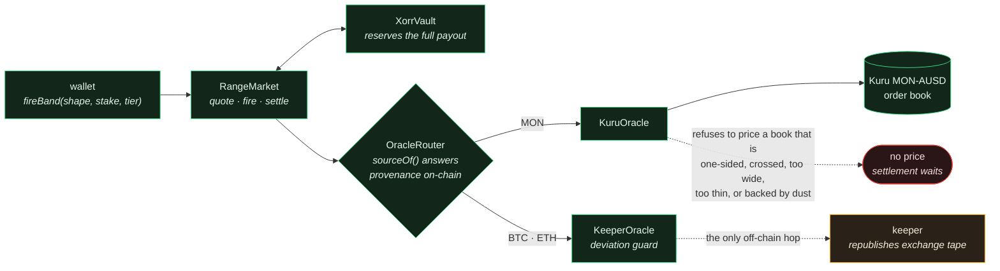

# XORR

**Built for fun and money.** A handheld console for trading price ranges on Monad.

You paint a band around the price, pick how long it has to hold, and hit the red key.
If the price prints inside your band at the cutoff block, you get paid the multiplier.
The whole round takes three seconds.

Monad settles a block every 300ms. That is the entire reason this works: a three-second
round is a real market with a real cutoff, not a countdown timer waiting on a chain.

**The MON market's price is an order book.** Not a feed reporting one — the midpoint of
real resting orders on [Kuru](https://docs.kuru.io), Monad's native CLOB, read on-chain
by a contract at the block you are settling on. There is no relayer, no API, and nothing
off-chain between the venue and the settlement.

```
pnpm install
pnpm dev            # the console, on paper — no wallet, no funding
```

The demo desk needs nothing. It fetches the real current price, replays real
one-second market tape, and prices every band with the same code the contracts use.

---

## What is actually real

| Piece | What it is |
|---|---|
| Prices | BTC/ETH from live Binance one-second tape; **MON from Kuru's order book, on-chain** |
| Order book | Real Kuru MON-AUSD market (`0x131A2e70…70Da9`) — depth, top of book and swaps |
| Stablecoin | Agora **AUSD** (`0x00000000eFE302BEAA2b3e6e1b18d08D69a9012a`), the real token |
| Distribution | Measured from real tape per round length — not an assumed bell curve |
| Settlement | A public transaction anyone can send once the cutoff block passes |
| Demo desk | Replays real returns; identical pricing kernel to the deployed contract |

There are no mocks in what ships. The one test double (`TestOracle`) lives under
`packages/contracts/test/helpers/` and is unreachable from `src/` or any deploy script.

---

## The order book is the price

Nothing between the venue and the settlement is off-chain. The dashed edge is the only
one that leaves the chain at all, and it carries BTC/ETH — never MON.



`KuruOracle` reads `bestBidAsk()` on Kuru's deployed MON-AUSD market and returns the
midpoint. `OracleRouter` sends MON there and BTC/ETH to the push feed, so one
`RangeMarket` serves both without knowing the difference — and a market can be moved
from a feed to a book without redeploying it.

Reading a book instead of a feed changes the failure modes, so they are guarded rather
than averaged away:

| Condition | What the oracle does |
|---|---|
| One side empty | Reports **no price**. A one-sided book has no midpoint. |
| Crossed mid-update | Reports no price. That is a snapshot artifact, not a quote. |
| Spread wider than the guard | Reports no price. The midpoint of a very wide book is a number nobody quoted. |
| Below 8-decimal resolution | Reports no price rather than rounding to zero. |

A price feed fails by going silent. An order book fails by going **thin** — and a thin
book still returns a number, which is the dangerous part.

```
pnpm check:kuru     # top of book, depth, health, against the deployed market
```

### Deep is not the same as live

The console currently reports MON as **RESTING**: the book has ~370 MON on the touch and
a 198 bps spread, but it has not traded in an hour. Depth answers *could I trade here*.
Recent flow answers *does this price change* — and only the second makes a three-second
market real. A range on a price that cannot move inside the round is a free option on
the house, so MON stays mark-only and the app says exactly why.

That verdict is the integration working, not a gap in it.

### Topping up goes through the book too

Everyone arriving on Monad holds MON and nobody holds AUSD, so **Add funds** opens on a
swap that sells MON for AUSD through Kuru's router. The quote walks the real resting
bids rather than multiplying a spot price by a size — 900 MON against the current book
fills at an average of 0.025351 for 36 bps of impact across three levels, where quoting
the touch would promise 0.025442 and a fill nobody could get.

---

## The interesting part: the price does not move

Over a three-second BTC round, the price often does not move **at all** — the same tick
prints at both ends. A normal distribution puts exactly zero probability on that, so
pricing a tight band off a bell curve hands the player a multiplier the house cannot
cover.

So every round carries a **measured** distribution table, built from real tape, sampled
on a 0.25σ grid and stored on-chain. `Pricing.sol` interpolates it. The TypeScript in
`packages/sdk` mirrors it exactly — 1,728 quotes are diffed between the two on every
test run, and they are identical.

```
pnpm calibrate      # refit from live tape, regenerate both implementations
```

### And the honest part: the spread is wider than the fee

The fee is 4%. The effective edge is not.

Volatility moves faster than any fixed calibration. Fitting on the immediately
preceding window errs in *both* directions — measured on held-out tape, an unshaded fit
ran between +5% and −25% per round depending purely on which way the regime moved. A
market that is profitable or ruinous depending on the weather is not a market.

So the quoted chance is not the middle of what the market has recently done. Sigma is
estimated off the quiet end of recent windows, and the win-rate table is quoted at the
high end of them — the 65th percentile of what each band width actually returned across
many recent windows, rather than a single point fit. That asymmetry is the whole safety
argument: the multiplier is (1 − fee) / p, so quoting p below the truth pays more than
the event is worth, and only a one-sided estimate rules that out.

It costs a wide spread. Replayed across four disjoint stretches of held-out tape the
realised edge ran from about 3% to about 42%, depending far more on how volatile the
stretch was than on the round length. It is always in the house's favour, which is the
point, but it is not 4% and the app does not claim it is.
`tools/checks/paper-calibration.mjs` measures it against real tape and fails if any
round length turns player-positive.

This is why **no win percentage is printed on the deck**. The model's number is a
pricing input, not a forecast, and showing it as one would be a lie. The keeper narrows
the spread by re-marking volatility on-chain as it moves.

---

## Layout

```
packages/contracts   Solidity — RangeMarket, RoomMarket, XorrVault, oracle adapters
packages/sdk         Pricing kernel, paper engine, calibration, generated ABIs
apps/web             Next.js console (landing, desk, /api/price /api/leaderboard /api/rpc)
tools                Keeper, model generator, calibration and verification checks
```

### Contracts

- **RangeMarket** — quote, fire, stack, settle. `fireBand` takes a band's *shape* and
  centres it on the print at execution, which removes a race that reverts opens on a
  300ms chain.
- **XorrVault** — the bankroll. Reserves the **full payout** on every open ticket, so a
  round where every player wins is still fully covered. Capped at 80% utilisation.
- **RoomMarket** — player-vs-player rooms. The house takes a fee and carries no risk.
- **KuruOracle** — the MON price, read from Kuru's book on-chain. Also decodes the L2
  ladder, so the console gets typed depth from one call instead of unpacking bytes.
- **OracleRouter** — per-market dispatch, and `sourceOf()` so provenance is answerable
  from the chain rather than from the interface's word.
- **Other oracles** — `KeeperOracle` (a real push feed with a deviation guard),
  `ChainlinkOracle`, `PythOracle`. Nothing named "mock" is deployable.

### Running it live

```
pnpm chain                    # anvil, forking Monad mainnet at 300ms
KURU_MON_AUSD=0x131a2e70a5b31a517a74b8c567149bc294470da9 pnpm deploy:local
pnpm setup:local              # funds the vault with real AUSD, starts the keeper
pnpm --filter @xorr/web build && pnpm --filter @xorr/web start
```

The fork gives real Monad state, the real AUSD contract and real signed transactions
at 300ms, without spending anything.

---

## Tests

```
pnpm test           # 104 Solidity tests, 33 TypeScript tests
pnpm parity         # 1,728 quotes diffed between Solidity and TypeScript
```

Beyond unit tests, `tools/checks/` holds the ones that check claims rather than code:

| Check | Question it answers |
|---|---|
| `chain-parity.mjs` | Does the deployed contract quote what the SDK quotes? |
| `paper-calibration.mjs` | Does the demo desk's realised edge favour the vault, on real tape? |
| `edge-by-width.mjs` | Is the edge stable across band widths, or punitive at some? |
| `sigma-percentile.mjs` | How conservative does volatility have to be to stay solvent? |
| `live-win.mjs` | Is a winner paid exactly the payout the ticket promised? |
| `room-round.mjs` | Does a room's pot close out to exactly zero? |
| `kuru-book.mjs` | Does the oracle read the deployed Kuru market, and refuse a thin one? |
| `ui-quote.mjs` | Does the number the console printed match the kernel, recomputed from what was on screen? |

`docs/VERIFY.md` pairs every claim in this README with the command that proves it,
and states what is trusted and what is not. `docs/TEST-PLAN.md` is the full plan every
component was verified against.
